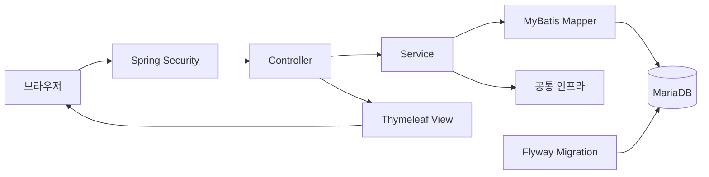

# Repository Guidelines

## 프로젝트 구조와 모듈 구성

이 프로젝트는 Java 21, Spring Boot 4, Spring MVC, Thymeleaf, Spring Security, MyBatis, Flyway, MariaDB를 사용한다. 애플리케이션 코드는 `src/main/java/com/cakeshop`에 둔다. 기능은 `domain/<도메인>/` 아래에 `controller`, `service`, `mapper`, `entity`, `dto/form`, `dto/view`, `error` 패키지를 두는 수직 슬라이스 구조로 구성한다. 둘 이상의 도메인이 실제로 공유하는 기반 코드만 `global`에 둔다.

MyBatis XML은 `src/main/resources/mapper/<도메인>/`, 화면 템플릿은 `src/main/resources/templates/{admin,customer}`, Flyway migration은 `src/main/resources/db/migration`에 둔다. 테스트는 `src/test/java`에서 운영 코드의 패키지 구조를 따르고, 테스트 설정은 `src/test/resources`에 둔다. `bin`, `build`, `out`은 생성 결과물이므로 직접 수정하지 않는다.

## 아키텍처 개요



계층을 건너뛰거나 역방향으로 참조하지 않는다. 각 도메인의 기본 구성은 다음과 같다.

```text
domain/<도메인>/
├── controller/
├── service/
├── mapper/
├── entity/
├── dto/
│   ├── form/
│   └── view/
└── error/
```

## 도메인 담당과 협업 경계

담당자는 해당 도메인의 최종 오너이자 우선 리뷰 대상이다. 담당 외 도메인도 작업할 수 있지만, 공개 Service 인터페이스나 상태 전이처럼 다른 담당자에게 영향을 주는 변경은 먼저 협의한다.

| 담당 | 도메인 |
|---|---|
| 수민 | `member`, `cart` |
| 주환 | `order`, `payment` |
| 정후 | `coupon` |
| 민정 | `chat`, `notification` |
| 현규 | `community`, `review` |
| 시은 | `product` |
| 공통 협의 | `store`, `global`, `home` |
| 후반 작업 | `statistics` |

결제 흐름은 `cart -> order/payment <- coupon`이 연결되므로 공개 인터페이스, 금액 계산, 상태 전이를 변경할 때 수민·주환·정후가 함께 검토한다. 담당과 개발 순서의 정본은 `docs/team-plan.md`이며, 이 표와 내용이 다르면 정본을 우선한다.

## 빌드, 테스트, 로컬 실행

- `.\gradlew.bat bootRun`(Windows) 또는 `./gradlew bootRun`: 애플리케이션을 로컬에서 실행한다.
- `.\gradlew.bat test` 또는 `./gradlew test`: 전체 JUnit Platform 테스트를 실행한다. MariaDB Testcontainers 테스트에는 실행 중인 Docker가 필요하다.
- `.\gradlew.bat build` 또는 `./gradlew build`: 컴파일, 테스트, 패키징을 수행한다.
- `.\gradlew.bat clean test`: 빌드 캐시 문제가 의심될 때만 결과물을 지우고 테스트를 다시 실행한다.

## 코딩 스타일과 명명 규칙

세부 기준은 `docs/conventions.md`를 정본으로 따른다. 공백 4칸, 탭 금지, K&R 중괄호, 명시적 import, 생성자 주입을 사용하며 한 줄은 120자 이내를 권장한다. 의존 방향은 `Controller -> Service -> Mapper -> DB`를 지킨다. 클래스 역할이 드러나도록 `ProductAdminController`, `ProductService`, `ProductMapper`, `ProductCreateForm`, `ProductDetailView`처럼 이름을 짓는다. MyBatis 값은 `#{}`로 바인딩하고 사용자 입력에 `${}`를 사용하지 않는다.

## 테스트 지침

`docs/testing.md`를 따른다. 테스트 클래스는 `*Tests`, 메서드는 `method_condition_expectedResult` 형식으로 작성한다. JUnit 5, AssertJ, Mockito, MockMvc, Spring Security Test를 사용한다. DB 동작은 `@MybatisTest`, `@MariaDbIntegrationTest`와 MariaDB Testcontainers로 검증한다. H2나 공용 DB로 대체하지 않는다. 정상 흐름뿐 아니라 유효성 검사, 권한, rollback, 금지된 상태 전이를 테스트한다.

## 커밋과 Pull Request

최근 이력과 `docs/pull-request.md`에 따라 커밋 제목은 `<type>: 한글 요약` 형식으로 작성한다. 예: `fix: 회원 이름 컬럼 마이그레이션 추가`. type은 `feat`, `fix`, `refactor`, `test`, `docs`, `ci`, `chore`를 사용한다.

PR 하나에는 하나의 목적만 담는다. 본문에 변경 목적, 주요 변경, 테스트 결과, DB/Flyway 영향, 집중 리뷰 사항, 관련 이슈를 작성하고 화면 변경에는 스크린샷을 첨부한다. 공유된 Flyway migration은 수정하지 말고 새 versioned migration을 추가한다. CI 통과, 미해결 리뷰 정리, 최소 1명 승인을 병합 조건으로 한다.

## 보안과 설정

`.env`의 비밀 값을 커밋하지 않는다. 인증 정보, 개인정보, SQL, 내부 경로를 응답이나 로그에 노출하지 않는다. 회원 소유권은 Service에서 인증 사용자 기준으로 검증하고, 관리자 기능은 화면 숨김이 아니라 Spring Security에서 `ADMIN` 권한을 강제한다.
